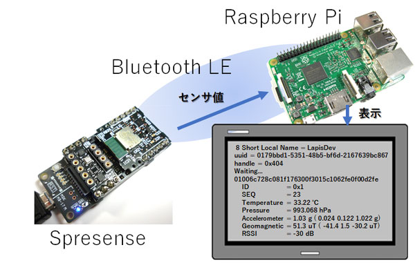

# 【内容】  
ローム製Bluetooth LE Add-onボードSPRESENSE-BLE-EVK-701と、センサAdd-onボード
SPRESENSE-SENSOR-EVK-701 を ソニー・セミコンダクタ・ソリューションズ製 Spresenseへ
接続し、各センサ値をBLE送信するためのプログラムです。

	ble_sensor:
	1.フォルダごと、パソコンにダウンロードしてください。
	2.Arduino IDEでble_sensorフォルダ内のble_sensor.inoを開いてください。
	3.Writeボタンで、Spresenseへ書き込んでください。
	
	ble_logger.py:
	Raspberry PiなどでBLEスキャンを行うツールです。
	sudoを付与して実行してください。
	
	ble_logger_sens_gatt.py:
	ble_sensorが送信するビーコンに含まれる温度センサと気圧センサの
	センサ値データを受信し、表示するツールです。
	
	ble_logger_sens_gatt.py:
	ble_sensorが送信する全センサ値データを受信するツールです。
	Lapis独自のVSSPPプロファイルを使用します。

# 【システム概要】  

サンプルプログラムble_sensor（Arduino IDE用・ble_sensorフォルダ内）を書き込んだSpresenseに、
ローム製Bluetooth LE拡張ボードとセンサ拡張ボードを接続します。
ble_sensorが送信するビーコンをRaspberry Pi上で動作するサンプルプログラムble_logger_sens_gatt.pyで受信し、
Lapis独自のVSSPPプロファイルでセンサ値を取得します。

# 【送信データ】  
センサから得られた、温度、気圧、加速度、地磁気などのデータは、疑似シリアル通信（VSSPP）で送信します。  
ビーコンのScan Responseでも送信しますが、10バイト（データ6バイト）の容量に抑えており、温度と気圧しか送信できません。  

# 【ライセンス】
本プログラムやレポジトリに下記からダウンロードしたソースリストが含まれます。  
https://github.com/RohmSemiconductor/Arduino
  
元の権利は Rohm と KokiOkada に帰属し、改変部の権利は国野亘に帰属します。  
配布時はファイル「LISENSE」を添付ください。
https://github.com/bokunimowakaru/rohm_iot_for_spresense/blob/master/ble_sensor/LICENSE
